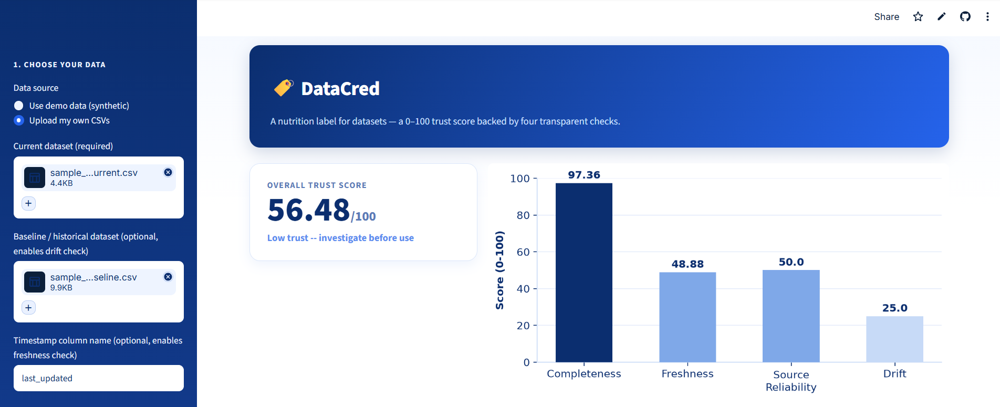
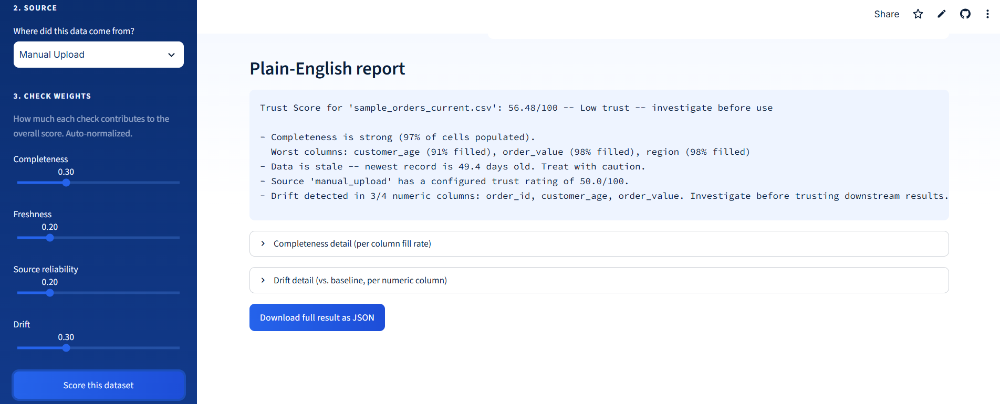
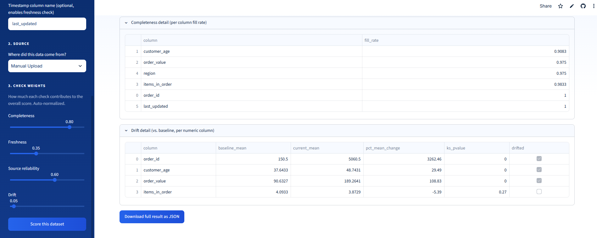
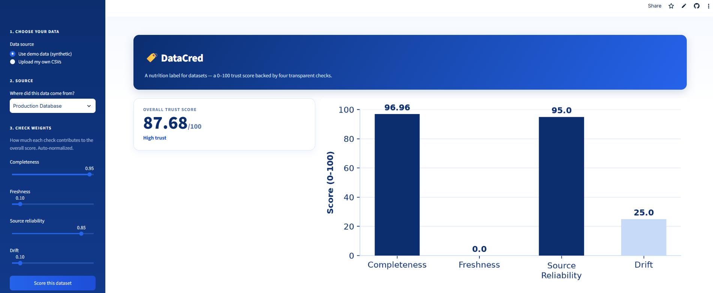

<div align="center">

# 🏷️ DataCred

### A "Nutrition Label" for Datasets

*A 0–100 trust score, backed by four transparent checks, that lets you sanity-check a dataset in seconds — before it trains a model or drives a decision.*

[](https://datacred.streamlit.app/)
[](https://www.python.org/)
[](https://streamlit.io/)

**Program:** IBM SkillsBuild Data Analytics with AI Academic Internship (BharatCares × AICTE)
**Author:** Amruta Dabholkar

[**🚀 Try the live app**](https://datacred.streamlit.app/) · [📓 View the notebook](Amruta_DataCred.ipynb) · [📄 Project report](Amruta_ProjectReport.docx)

</div>

---

## 📋 Table of Contents

- [Why DataCred](#-why-datacred)
- [The four checks](#-the-four-checks)
- [Screenshots](#-screenshots)
- [Project structure](#-project-structure)
- [Dataset](#-dataset)
- [Tech stack](#-tech-stack)
- [Run it locally](#-run-it-locally)
- [Deploy your own copy](#-deploy-your-own-copy)
- [Sample results](#-sample-results)
- [Possible extensions](#-possible-extensions)

---

## 💡 Why DataCred

Before a dataset is used to train a model or drive a business decision, it needs to be sanity-checked — but in practice this rarely happens consistently. A dataset can look fine at a glance while being significantly incomplete, out of date, pulled from an unreliable source, or statistically different from the data a model was originally trained on.

**DataCred** builds a single, explainable trust score — the same idea as a nutrition label: a fast, standardized way to check something before you consume it.

## 🔍 The four checks

| Check | What it measures | Method |
|---|---|---|
| **Completeness** | How much of the dataset is populated | % non-null cells, per column |
| **Freshness** | How current the data is | Age of newest record vs. a decay curve |
| **Source reliability** | How trusted the data's origin is | Configurable lookup table |
| **Drift** | Whether the data's distribution has shifted | Two-sample Kolmogorov–Smirnov test vs. a historical baseline |

The four scores combine into one weighted overall trust score (0–100), with a plain-English explanation of *why* it landed where it did.

## 📸 Screenshots

<table>
<tr>
<td width="50%">

**Trust score breakdown**


</td>
<td width="50%">

**Plain-English report**


</td>
</tr>
<tr>
<td width="50%">

**Completeness & drift detail**


</td>
<td width="50%">

**High-trust dataset example**


</td>
</tr>
</table>

## 📁 Project Structure

```
.
├── Amruta_DataCred.ipynb      # original analysis notebook — source of truth for the scoring logic
├── Amruta_ProjectReport.docx  # written project report
├── app.py                     # Streamlit dashboard version of the same logic
├── requirements.txt           # Python dependencies
├── .streamlit/config.toml     # app theme
├── csv_files/                 # sample CSVs for testing the upload feature
└── screenshots/                # app screenshots used in this README
```

## 📊 Dataset

The notebook generates its own **synthetic retail sales dataset**, designed to mimic a realistic e-commerce orders table. Synthetic data was used deliberately so the project could inject *known* data-quality problems — missing values, stale timestamps, and distribution drift — and demonstrate DataCred correctly catching each one.

The same code works unchanged on any real CSV; the Streamlit app lets you upload your own **current** and **baseline** datasets directly. Two ready-to-use sample files are included in [`csv_files/`](csv_files/) if you want to try this without your own data.

## 🛠️ Tech Stack

- **Python 3** — core language
- **pandas / NumPy** — data loading, cleaning, manipulation
- **SciPy** (`stats.ks_2samp`) — statistical drift detection
- **Matplotlib** — score breakdown visualization
- **Streamlit** — interactive dashboard / web app
- **Jupyter Notebook** — original analysis and delivery format
- **IBM Bob** (VS Code AI coding agent) — used to scaffold and iterate on the code during development

## ▶️ Run it locally

```bash
git clone https://github.com/Amruta-Dabholkar/DataCred.git
cd DataCred
pip install -r requirements.txt
streamlit run app.py
```

This opens an interactive version of the scoring pipeline in your browser: pick the demo data or upload your own CSVs, adjust the check weights live, and download the JSON result.

To explore the underlying analysis instead:

```bash
jupyter notebook Amruta_DataCred.ipynb
```

## ☁️ Deploy your own copy

1. Fork or clone this repository to your own GitHub account.
2. Go to [share.streamlit.io](https://share.streamlit.io) and sign in with GitHub.
3. Click **New app**, select your repo/branch, and set the main file path to `app.py`.
4. Click **Deploy** — you'll get a permanent public URL in a few minutes.

## 📈 Sample Results

Running the notebook (or the app, with demo data selected) produces:

```
OVERALL TRUST SCORE: 55.55 / 100 -- Low trust -- investigate before use

- Completeness is strong (97% of cells populated).
  Worst columns: customer_age (88% filled), region (95% filled), order_value (98% filled)
- Data is stale -- newest record is 385.4 days old. Treat with caution.
- Source 'production_database' has a configured trust rating of 95.0/100.
- Drift detected in 3/4 numeric columns vs. baseline: order_id, customer_age, order_value.
```

This confirms DataCred correctly identifies the exact issues deliberately injected into the "current" dataset — staleness and distribution drift — while correctly recognizing that completeness and source reliability were both strong. The score is driven by real, explainable signal rather than a single blunt metric.

## 🚧 Possible Extensions

- [ ] Categorical drift detection (chi-squared test) alongside the numeric KS test
- [ ] Scheduled scoring with automated alerts when a score drops below a threshold
- [ ] A score-history log to track a dataset's trust score over time
- [ ] An optional AI-generated narrative summary layered on top of the deterministic score, for non-technical stakeholders

---

<div align="center">

Built by **Amruta Dabholkar** as part of the IBM SkillsBuild Data Analytics with AI Academic Internship (BharatCares × AICTE)

</div>
